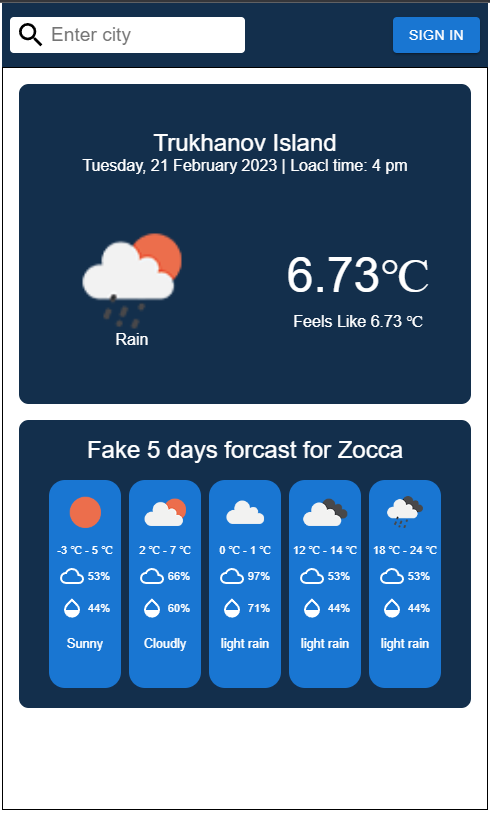

# Weather-app



# Features
- Current weather by user coordinates
- Current weather in city
- Store cities bookmarks for users

# Quick Start

## Local setup

1. Create file `.env.local` and provide variables:
```bash
MONGO_URL=your_data_base_url
WEATHER_BASE_URL=https://api.openweathermap.org/
WEATHER_API_KEY=your_api_key
VERCEL_URL=localhost:3000
```
2. Instal dependencies and run project

```bash
yarn
yarn dev
```

## Vercel
1. Sign in/up on [Vercel](https://vercel.com/)
2. Deploy project via [guide](https://vercel.com/docs/concepts/get-started/deploy) 
3. Add environment variables for project via [guide](https://vercel.com/docs/concepts/projects/environment-variables)

# License
Released under the [MIT License](./LICENSE).
